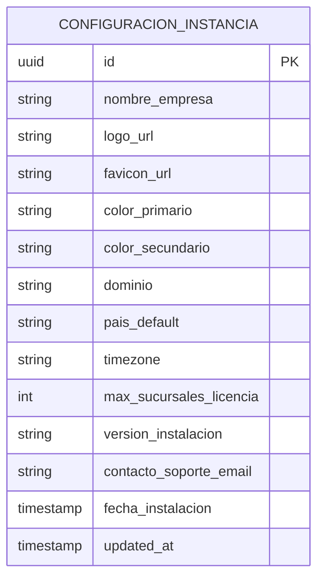

# Recomendaciones de Modernización — Virtual Tour de Sucursales

> Análisis basado en el sistema actual y el diagrama ER proporcionado.
> Fecha: 2026-05-29

---

## 1. STACK TECNOLÓGICO RECOMENDADO

### Frontend (Viewer público + Admin)
| Capa | Tecnología | Justificación |
|------|-----------|---------------|
| Framework | **React 19 + TypeScript** | Concurrencia nativa, Server Components, tipado fuerte |
| Build tool | **Vite 6** | HMR ultrarrápido, tree-shaking óptimo |
| Routing | **React Router v7** (o TanStack Router) | Code splitting por ruta, layouts anidados |
| UI Components | **shadcn/ui + Tailwind CSS v4** | Sin overhead, 100% personalizable |
| Data fetching | **TanStack Query v5** | Cache, invalidación, estados de carga |
| Estado global | **Zustand** | Liviano, sin boilerplate |
| Forms | **React Hook Form + Zod** | Validación isomórfica schema-first |
| Visor 360° | **@photo-sphere-viewer/core** (PSV) | Mejor soporte móvil, hotspots nativos, plugins ricos |
| Canvas planos | **Konva.js / React-Konva** | Canvas 2D declarativo en React |
| Iconos | **Lucide React** | Consistente con shadcn/ui |
| i18n | **i18next** | Si hay necesidad multiidioma |

### Backend (on-premise — servidor del cliente)
| Capa | Tecnología | Justificación |
|------|-----------|---------------|
| Runtime | **Node.js 22 LTS** | LTS estable, soporte nativo ESM |
| Framework | **NestJS** | Modular, inyección de dependencias, decoradores, ideal para APIs grandes |
| ORM | **Prisma 6** | Migraciones seguras, type-safety, fácil de mantener |
| Base de datos | **PostgreSQL 16** | Soporte jsonb, índices GIN, full-text search, open-source |
| Almacenamiento de archivos | **MinIO** ⭐ | S3-compatible, self-hosted, interfaz web incluida, ideal para fotos 360° y docs |
| Auth | **NestJS + Passport + JWT** | Control total, sin dependencias externas, refresh token rotativo |
| Caché | **Redis (self-hosted)** | Caché de metadatos, sesiones, colas de tareas |
| Cola de tareas | **BullMQ + Redis** | Procesamiento de imágenes 360° (thumbnails, tiles) en background |
| Proxy reverso | **Nginx** | Servir frontend, balanceo, SSL/TLS |
| Contenedores | **Docker + Docker Compose** | Instalación reproducible en cualquier servidor Linux |

> **¿Qué es MinIO?** Es un servidor de almacenamiento de archivos open-source que funciona igual que Amazon S3 pero instalado en tu propio servidor. Perfecto para fotos 360°, PDFs y documentos. Tiene una interfaz web para explorar los archivos y genera URLs firmadas con expiración para seguridad.

### Infraestructura on-premise (todo en el servidor del cliente)
```
Servidor Linux (Ubuntu 22.04 LTS recomendado)
└── Docker Compose
    ├── nginx          → Proxy reverso + SSL (puerto 80/443)
    ├── web (Vite)     → Viewer público del tour
    ├── admin (Vite)   → Portal de administración
    ├── api (NestJS)   → API REST + WebSockets
    ├── postgres       → Base de datos principal
    ├── redis          → Caché + colas BullMQ
    └── minio          → Almacenamiento de archivos (fotos 360°, PDFs, etc.)

CI/CD: GitHub Actions → build → SSH deploy al servidor
```

### Requisitos del servidor (calibrado para 20 sucursales / 50 usuarios concurrentes)
| Recurso | Mínimo | Recomendado |
|---------|--------|-------------|
| CPU | 4 vCPU | 8 vCPU |
| RAM | 8 GB | 16 GB |
| Disco | 200 GB SSD | 500 GB SSD |
| SO | Ubuntu 22.04 LTS | Ubuntu 22.04 LTS |
| Docker | 24+ | 27+ |
| Conectividad | ✅ Internet + dominio | — |

> **Estimación de disco:** 20 sucursales × ~5 espacios × ~30 MB/foto = ~3 GB en fotos 360°. Con PDFs, thumbnails y backups, 200 GB es holgado. Con 500 GB crece sin problema por varios años.

### Ventajas al tener internet en el servidor
- **SSL/TLS gratuito y automático** con Let's Encrypt via Nginx + Certbot (renovación automática)
- **Imágenes Docker** se descargan directamente desde Docker Hub / GitHub Container Registry
- **CI/CD via GitHub Actions** puede hacer deploy por SSH directamente al servidor tras cada push
- **Actualizaciones de dependencias** sin necesidad de transferencia manual
- **Cloudflare como CDN** (opcional, gratuito): caché de fotos 360°, DDoS protection y compresión — reduce carga al servidor especialmente con 50 usuarios concurrentes
- **Watchtower** (Docker): actualiza los contenedores automáticamente cuando hay nueva imagen en el registry
- **Script de instalación remoto**: un nuevo cliente puede instalar la instancia con un solo comando `curl | bash` que descarga y configura todo

### Monorepo (recomendado)
```
apps/
  web/        → Viewer público del tour virtual
  admin/      → Portal de administración
  api/        → Backend NestJS

packages/
  ui/         → Componentes compartidos (design system)
  types/      → Tipos TypeScript compartidos
  config/     → ESLint, Tailwind, tsconfig base
  api-client/ → Cliente axios/fetch tipado (generado desde OpenAPI)
```

---

## 2. ARQUITECTURA DEL PORTAL ADMIN

### Módulos del Admin
```
Dashboard
├── Resumen de sucursales activas, documentos recientes, alertas
│
Sucursales
├── Listado con filtros (región, estado, ciudad)
├── Crear/Editar sucursal
├── Editor de Planimetría (Canvas) ← CLAVE
│   ├── Subir imagen base del plano (SVG o PNG)
│   ├── Añadir marcadores de espacios 360°
│   ├── Configurar hotspots entre espacios
│   └── Vista previa del tour resultante
├── Galería de espacios 360°
│   ├── Subir fotos 360° (drag & drop, progreso)
│   ├── Editor de hotspots sobre el visor
│   └── Ordenar espacios (drag & drop)
│
Infraestructura
├── Comunicaciones por sucursal
├── Baterías
└── Torres
│
Documentos / Biblioteca
├── Upload con categorías y versioning
└── Búsqueda full-text
│
Informes
├── Generar y adjuntar
└── Historial
│
Usuarios & Roles
├── CRUD usuarios
├── Asignar permisos granulares
└── Log de auditoría
│
Configuración
└── Categorías, íconos, parámetros globales
```

---

## 3. FLUJO DEL VIEWER PÚBLICO

```
Listado de Sucursales
  → Selección de sucursal
    → Carga del visor 360° (primer espacio)
      → Menú lateral contextual:
          [COMUNICACIONES] [BATERÍAS] [TORRE]
          [INFORMES] [PLANIMETRÍA] [BIBLIOTECA]
          [INFORMACIÓN] [SALIDA]
      → Hotspots en la foto 360° para navegar entre espacios
      → Mini-mapa del plano (overlay inferior)
      → Panel deslizante con info del espacio activo
```

---

## 4. DIAGRAMA ER MEJORADO

### Problemas detectados en el ER original y mejoras aplicadas:

**Problemas:**
- `CATEGORIAS_SUCURSAL` mezcla dos responsabilidades (categorías del menú + categorías de documentos)
- `INFRAESTRUCTURA` es redundante si ya existen `COMUNICACIONES`, `BATERIAS`, `TORRES`
- `HOTSPOTS` no define bien qué pasa cuando el destino no es otro espacio (enlace a doc, URL, info)
- Falta versionado de planimetrías de forma segura
- Falta auditoría (quién modificó qué y cuándo)
- `USUARIOS` debería delegar auth a Supabase Auth
- `DOCUMENTOS` referencia a `CATEGORIAS_SUCURSAL` mezclando contextos
- Falta soporte para etiquetas flexibles en documentos
- No hay tabla de notificaciones ni actividad

---

### ER Mejorado (Mermaid)

```mermaid
erDiagram

    %% ═══════════════════════════
    %% IDENTIDAD Y ACCESO
    %% ═══════════════════════════
    USUARIOS {
        uuid id PK
        string nombre
        string email
        uuid rol_id FK
        boolean activo
        string avatar_url
        timestamp created_at
        timestamp updated_at
    }

    ROLES {
        uuid id PK
        string nombre
        string descripcion
        boolean es_sistema
    }

    PERMISOS {
        uuid id PK
        string recurso
        string accion
        string descripcion
    }

    ROL_PERMISOS {
        uuid rol_id FK
        uuid permiso_id FK
    }

    %% ═══════════════════════════
    %% SUCURSALES Y ESPACIOS
    %% ═══════════════════════════
    SUCURSALES {
        uuid id PK
        string nombre
        string codigo UK
        string ciudad
        string region
        string pais
        string direccion
        string estado
        jsonb coordenadas_geo
        string imagen_portada_url
        string descripcion
        uuid creado_por FK
        timestamp created_at
        timestamp updated_at
    }

    ESPACIOS_360 {
        uuid id PK
        uuid sucursal_id FK
        string nombre
        string descripcion
        string foto_360_url
        string thumbnail_url
        int orden
        boolean activo
        jsonb metadata_imagen
        timestamp created_at
        timestamp updated_at
    }

    HOTSPOTS {
        uuid id PK
        uuid espacio_origen_id FK
        uuid espacio_destino_id FK "nullable"
        float pitch
        float yaw
        string tipo "enum: navegacion|informacion|documento|url_externo"
        string etiqueta
        jsonb payload "destino o contenido según tipo"
        boolean activo
    }

    %% ═══════════════════════════
    %% PLANIMETRÍAS
    %% ═══════════════════════════
    PLANIMETRIAS {
        uuid id PK
        uuid sucursal_id FK
        string nombre
        string imagen_base_url
        jsonb canvas_data
        int version
        boolean es_publicada
        uuid creado_por FK
        uuid actualizado_por FK
        timestamp created_at
        timestamp updated_at
    }

    HISTORIAL_PLANIMETRIAS {
        uuid id PK
        uuid planimetria_id FK
        int version
        jsonb canvas_data_snapshot
        string imagen_url_snapshot
        string comentario
        uuid guardado_por FK
        timestamp guardado_at
    }

    PLANIMETRIA_PUNTOS {
        uuid id PK
        uuid planimetria_id FK
        uuid espacio_360_id FK
        float pos_x
        float pos_y
        string etiqueta
        string icono
        string color
        boolean visible
    }

    %% ═══════════════════════════
    %% CATEGORÍAS (separadas)
    %% ═══════════════════════════
    CATEGORIAS_MENU {
        uuid id PK
        string nombre
        string slug UK
        string icono
        string color
        int orden
        boolean activo
    }

    SUCURSAL_MENU {
        uuid id PK
        uuid sucursal_id FK
        uuid categoria_menu_id FK
        boolean habilitada
        int orden_personalizado
    }

    CATEGORIAS_DOCUMENTO {
        uuid id PK
        string nombre
        string slug UK
        string icono
        boolean activo
    }

    %% ═══════════════════════════
    %% INFRAESTRUCTURA
    %% ═══════════════════════════
    COMUNICACIONES {
        uuid id PK
        uuid sucursal_id FK
        string tipo_enlace
        string proveedor
        string capacidad
        string estado "enum: activo|inactivo|degradado"
        jsonb detalles
        uuid actualizado_por FK
        timestamp ultima_actualizacion
        timestamp created_at
    }

    BATERIAS {
        uuid id PK
        uuid sucursal_id FK
        string modelo
        string fabricante
        int cantidad
        string estado "enum: operativo|mantenimiento|fuera_servicio"
        string capacidad_ah
        date fecha_instalacion
        date proxima_revision
        jsonb datos_tecnicos
        uuid actualizado_por FK
        timestamp updated_at
    }

    TORRES {
        uuid id PK
        uuid sucursal_id FK
        float altura_metros
        string tipo_estructura
        string estado "enum: operativo|mantenimiento|fuera_servicio"
        jsonb equipos_instalados
        date fecha_inspeccion
        uuid actualizado_por FK
        timestamp updated_at
    }

    %% ═══════════════════════════
    %% DOCUMENTOS Y BIBLIOTECA
    %% ═══════════════════════════
    DOCUMENTOS {
        uuid id PK
        uuid sucursal_id FK
        uuid categoria_id FK
        string titulo
        string descripcion
        string archivo_url
        string tipo_archivo "enum: pdf|docx|xlsx|pptx|img|otro"
        int version
        int tamanio_bytes
        uuid subido_por FK
        boolean activo
        timestamp created_at
        timestamp updated_at
    }

    VERSIONES_DOCUMENTO {
        uuid id PK
        uuid documento_id FK
        int version
        string archivo_url
        string comentario_cambio
        uuid subido_por FK
        timestamp created_at
    }

    DOCUMENTO_TAGS {
        uuid documento_id FK
        uuid tag_id FK
    }

    TAGS {
        uuid id PK
        string nombre
        string slug UK
        string color
    }

    INFORMES {
        uuid id PK
        uuid sucursal_id FK
        string titulo
        string tipo "enum: tecnico|operacional|incidente|auditoria"
        string descripcion
        string archivo_url
        date fecha_informe
        string estado "enum: borrador|publicado|archivado"
        uuid generado_por FK
        timestamp created_at
        timestamp updated_at
    }

    BIBLIOTECA {
        uuid id PK
        string titulo
        string descripcion
        uuid categoria_id FK
        string archivo_url
        string tipo_archivo
        boolean publico
        int tamanio_bytes
        uuid subido_por FK
        timestamp created_at
        timestamp updated_at
    }

    %% ═══════════════════════════
    %% AUDITORÍA Y ACTIVIDAD
    %% ═══════════════════════════
    AUDIT_LOG {
        uuid id PK
        uuid usuario_id FK
        string tabla_afectada
        uuid registro_id
        string accion "enum: create|update|delete"
        jsonb datos_anteriores
        jsonb datos_nuevos
        string ip_address
        string user_agent
        timestamp created_at
    }

    ACTIVIDAD_USUARIO {
        uuid id PK
        uuid usuario_id FK
        uuid sucursal_id FK "nullable"
        string tipo_evento "enum: ver_sucursal|ver_espacio|descargar_doc|etc"
        jsonb metadata
        timestamp created_at
    }

    NOTIFICACIONES {
        uuid id PK
        uuid usuario_id FK
        string titulo
        string cuerpo
        string tipo "enum: info|alerta|sistema"
        boolean leida
        string enlace
        timestamp created_at
    }

    %% ═══════════════════════════
    %% CONFIGURACION
    %% ═══════════════════════════
    CONFIGURACION {
        string clave PK
        jsonb valor
        string descripcion
        timestamp updated_at
    }

    %% ════════════════════════════
    %% RELACIONES
    %% ════════════════════════════

    USUARIOS }o--|| ROLES : tiene
    ROLES ||--o{ ROL_PERMISOS : define
    PERMISOS ||--o{ ROL_PERMISOS : incluido_en

    SUCURSALES ||--o{ ESPACIOS_360 : contiene
    SUCURSALES ||--o{ PLANIMETRIAS : tiene
    SUCURSALES ||--o{ SUCURSAL_MENU : habilita
    CATEGORIAS_MENU ||--o{ SUCURSAL_MENU : aparece_en

    ESPACIOS_360 ||--o{ HOTSPOTS : es_origen
    ESPACIOS_360 ||--o{ HOTSPOTS : es_destino
    PLANIMETRIAS ||--o{ PLANIMETRIA_PUNTOS : contiene
    PLANIMETRIAS ||--o{ HISTORIAL_PLANIMETRIAS : versiona
    PLANIMETRIA_PUNTOS }o--|| ESPACIOS_360 : apunta_a

    SUCURSALES ||--o{ COMUNICACIONES : tiene
    SUCURSALES ||--o{ BATERIAS : tiene
    SUCURSALES ||--o{ TORRES : tiene

    SUCURSALES ||--o{ DOCUMENTOS : tiene
    DOCUMENTOS }o--|| CATEGORIAS_DOCUMENTO : clasificado_en
    DOCUMENTOS ||--o{ VERSIONES_DOCUMENTO : historial
    DOCUMENTOS ||--o{ DOCUMENTO_TAGS : etiquetado
    TAGS ||--o{ DOCUMENTO_TAGS : usado_en

    SUCURSALES ||--o{ INFORMES : tiene
    BIBLIOTECA }o--|| CATEGORIAS_DOCUMENTO : clasificado_en

    USUARIOS ||--o{ AUDIT_LOG : genera
    USUARIOS ||--o{ ACTIVIDAD_USUARIO : registra
    USUARIOS ||--o{ NOTIFICACIONES : recibe
```



---

## 5. CAMBIOS CLAVE AL ER ORIGINAL

| # | Cambio | Razón |
|---|--------|-------|
| 1 | `CATEGORIAS_SUCURSAL` → `CATEGORIAS_MENU` + `CATEGORIAS_DOCUMENTO` | Separación de responsabilidades: el menú contextual del viewer y las categorías de archivos son cosas distintas |
| 2 | `SUCURSAL_CATEGORIAS` → `SUCURSAL_MENU` con `orden_personalizado` | Permite reordenar el menú por sucursal |
| 3 | `HOTSPOTS.tipo` ahora es enum y `payload` es jsonb flexible | Un hotspot puede navegar a otro espacio, mostrar info, abrir doc o URL externa |
| 4 | `HOTSPOTS.espacio_destino_id` es nullable | No todos los hotspots llevan a otro espacio |
| 5 | `HISTORIAL_PLANIMETRIAS` nueva tabla | Versionado seguro del canvas; permite rollback |
| 6 | `INFRAESTRUCTURA` eliminada | Era genérica y redundante; `COMUNICACIONES`, `BATERIAS`, `TORRES` ya cubren los casos específicos con `datos_tecnicos jsonb` para extensibilidad |
| 7 | `VERSIONES_DOCUMENTO` nueva tabla | Historial de versiones de archivos con comentario de cambio |
| 8 | `TAGS` + `DOCUMENTO_TAGS` nuevas tablas | Etiquetado flexible transversal |
| 9 | `AUDIT_LOG` nueva tabla | Trazabilidad completa: quién, qué, cuándo, cambio anterior vs nuevo |
| 10 | `ACTIVIDAD_USUARIO` nueva tabla | Analytics: qué espacios y sucursales se visitan más |
| 11 | `NOTIFICACIONES` nueva tabla | Alertar sobre nuevos documentos, informes, mantenimientos |
| 12 | `CONFIGURACION` nueva tabla | Parámetros del sistema sin redeploy |
| 13 | `PERMISOS` + `ROL_PERMISOS` nuevas tablas | Permisos granulares por recurso/acción en vez de blob `jsonb` en ROLES |
| 14 | Campos `actualizado_por FK` en tablas de infraestructura | Trazabilidad de quién modificó equipos |
| 15 | `DOCUMENTOS.activo` y `INFORMES.estado` como enum | Soft delete y ciclo de vida de documentos |
| 16 | `SUCURSALES.codigo` con restricción UK | Código de sucursal único para búsquedas rápidas |

---

## 6. FEATURES DESTACADAS DEL VISOR PÚBLICO

### Visor 360° (Photo Sphere Viewer)
```tsx
// Plugins recomendados de PSV:
- @photo-sphere-viewer/markers-plugin    // Hotspots / marcadores
- @photo-sphere-viewer/map-plugin        // Mini-mapa planimetría
- @photo-sphere-viewer/virtual-tour-plugin // Navegación entre espacios
- @photo-sphere-viewer/gallery-plugin   // Selector de espacios
- @photo-sphere-viewer/compass-plugin   // Brújula orientativa
```

### Menú lateral contextual (panel deslizante)
Cada ítem del menú carga un panel con información vinculada a la sucursal activa:
- **COMUNICACIONES** → tabla de enlaces, proveedor, estado con badge colorido
- **BATERÍAS** → fichas técnicas con estado visual (semáforo)
- **TORRE** → datos de estructura + equipos instalados
- **INFORMES** → lista de informes con filtro por tipo y fecha
- **PLANIMETRÍA** → mini-mapa interactivo con puntos clickeables hacia espacios
- **BIBLIOTECA** → documentos globales con búsqueda
- **INFORMACIÓN** → datos generales de la sucursal
- **SALIDA** → volver al listado

---

## 7. FEATURES DESTACADAS DEL PORTAL ADMIN

### Editor de Planimetría (Canvas)
```
Tecnología: React-Konva (wrapper React de Konva.js)
Flujo:
1. Admin sube imagen base del plano (PNG/SVG/PDF convertido)
2. Posiciona marcadores circulares sobre el plano
3. Asigna cada marcador a un espacio 360° existente
4. Vista previa inmediata en el visor
5. Guarda versión con comentario (historial)
6. Publica versión cuando está lista
```

### Editor de Hotspots 360°
```
Flujo:
1. Admin abre un espacio 360° en modo edición
2. Hace doble clic en el visor para colocar hotspot
3. Modal aparece:   - Tipo: Navegación | Info | Documento | URL
   - Si Navegación: selecciona espacio destino
   - Si Documento: selecciona archivo de la sucursal
   - Si Info: escribe contenido HTML enriquecido
4. Guarda - el hotspot aparece inmediatamente en el visor
```

### Upload de Fotos 360°
```
- Drag & drop múltiple
- Validación de resolución mínima (recomendado: ≥ 4096×2048)
- Preview de esfera en tiempo real antes de guardar
- Generación automática de thumbnail (worker en background)
- Progreso por archivo con porcentaje
- Reordenamiento drag & drop de espacios
```

---

## 8. SEGURIDAD (OWASP Top 10 aplicado)

| Riesgo | Mitigación |
|--------|-----------|
| Broken Access Control | Guards NestJS por permiso + decoradores `@RequirePermission()` |
| Injection | Prisma ORM (queries parametrizadas), Zod en todos los inputs |
| Subida de archivos maliciosos | Validación MIME + magic bytes en API antes de enviar a MinIO, buckets privados |
| Datos sensibles expuestos | MinIO genera **presigned URLs** con expiración (ej: 1h), archivos nunca públicos directos |
| Auth insegura | JWT access token (15 min) + refresh token rotativo (7 días) en cookie HttpOnly |
| HTTPS | Nginx + **Let's Encrypt (Certbot)** — renovación automática, costo $0 |
| CORS | Allowlist explícita de dominios en NestJS |
| Rate limiting | `@nestjs/throttler` en endpoints de login y subida |
| Logs sin datos sensibles | Audit log sin passwords ni tokens; usar Winston + rotación de logs |
| Backups | Cron diario pg_dump → MinIO bucket separado de backup |

---

## 9. CONSIDERACIONES ADICIONALES

### Performance del visor 360°
- Usar **tiles progresivos** (PSV soporta tileado de imágenes grandes) para no cargar 50MB de golpe
- Precargar la foto 360° del espacio más cercano cuando el usuario esté mirando hacia un hotspot
- Imágenes almacenadas en CDN (Cloudflare) con headers de caché agresivos
- Thumbnail en WebP para listados

### SEO / Accesibilidad
- SSR o SSG del listado de sucursales (Next.js App Router o Astro para la landing)
- Alt texts en todos los thumbnails
- Aria-labels en controles del visor
- Modo alto contraste (Tailwind `dark:` + variable CSS)

### Mobile
- Photo Sphere Viewer tiene excelente soporte mobile con giroscopio
- Menú lateral como bottom sheet en mobile
- Touch gestures nativas en el visor

### Offline / PWA — ✅ REQUERIDO (viewer + admin)
- **Viewer**: Service Worker cache-first para sucursales visitadas recientemente; el tour funciona sin conexión
- **Admin**: PWA con cola de escritura offline (IndexedDB); ediciones y uploads se sincronizan al reconectar
- Librería: `vite-plugin-pwa` + `Workbox` + `idb-keyval`
- Banner de estado de conexión visible en ambas apps

---

## 10. ROADMAP SUGERIDO

```
FASE 0 — Infraestructura + Migración (2-3 semanas)
  ✓ Setup monorepo (Turborepo + Vite + NestJS)
  ✓ Docker Compose completo (nginx, api, postgres, redis, minio)
  ✓ Script de instalación con setup wizard (CONFIGURACION_INSTANCIA)
  ✓ Migraciones Prisma (esquema completo)
  ✓ Script de migración de fotos 360° existentes → MinIO
  ✓ CI/CD: GitHub Actions → SSH deploy

FASE 1 — Fundamentos (4-5 semanas)
  ✓ Auth propio: NestJS + Passport + JWT + refresh token
  ✓ CRUD sucursales, usuarios, roles, permisos
  ✓ Upload de fotos 360° (drag & drop + validación + thumbnail)
  ✓ Upload de PDFs (documentos, informes, biblioteca)
  ✓ CRUD infraestructura (comunicaciones, baterías, torres)

FASE 2 — Viewer público (4-5 semanas)
  ✓ Integración Photo Sphere Viewer
  ✓ Hotspots de navegación entre espacios
  ✓ Menú lateral contextual (los 8 ítems: Comunicaciones, Baterías, Torre,
    Informes, Planimetría, Biblioteca, Información, Salida)
  ✓ Mini-mapa con planimetría
  ✓ PWA viewer (offline cache de sucursales visitadas)

FASE 3 — Admin avanzado (4-5 semanas)
  ✓ Editor de planimetría con Konva.js
  ✓ Editor de hotspots en visor (doble clic para añadir)
  ✓ Versionado + historial de planimetrías
  ✓ Historial de versiones de documentos
  ✓ PWA admin (offline queue con IndexedDB + sync al reconectar)

FASE 4 — Operaciones (3-4 semanas)
  ✓ Audit log
  ✓ Analytics de visitas (espacios y sucursales más vistos)
  ✓ Notificaciones (nuevos docs, informes, mantenimientos)
  ✓ Dashboard con métricas
  ✓ Backup automático (pg_dump diario → MinIO)

FASE 5 — Pulido y QA (2-3 semanas)
  ✓ Optimización imágenes (tiles progresivos PSV)
  ✓ Tests E2E con Playwright (Chrome + Firefox)
  ✓ Performance audit (Lighthouse ≥ 90)
  ✓ Documentación de instalación para nuevos clientes
```

---

## 11. DECISIONES TÉCNICAS CONFIRMADAS

| # | Pregunta | Respuesta | Impacto en arquitectura |
|---|----------|-----------|-------------------------|
| 1 | ¿Existe backend? | ❌ No existe — **desarrollo desde cero** | NestJS greenfield, sin deuda técnica |
| 2 | ¿Cuántas sucursales? | ~**20 sucursales**, gestionadas desde admin | Carga muy manejable; el server mínimo es suficiente |
| 3 | ¿Usuarios concurrentes? | **50 usuarios** en el viewer | Sin necesidad de balanceo de carga; un solo nodo Docker es suficiente |
| 4 | ¿Integraciones externas? | ❌ Ninguna por ahora | Auth propio con JWT; no requiere LDAP/AD |
| 5 | ¿Fotos 360° existen? | ✅ Ya existen | Se añade **fase de migración/importación** al roadmap |
| 6 | ¿On-premise o cloud? | ✅ **On-premise** confirmado | Docker Compose en servidor del cliente |
| 7 | ¿Internet en servidor? | ✅ Confirmado | Let's Encrypt automático, CI/CD por SSH |
| 8 | ¿Dominio disponible? | ✅ Confirmado | SSL automático con Certbot |
| 9 | ¿Admin offline? | ✅ **Sí requiere** | Admin también como PWA con Service Worker + IndexedDB |
| 10 | ¿Cómo se cargan informes? | Solo **upload de PDFs** | Simplifica el módulo; no hay generación automática |
| 11 | ¿Multi-tenancy? | ❌ No ahora, pero **cada instalación = 1 instancia del cliente** | Tabla `CONFIGURACION_INSTANCIA` para identidad y branding por cliente |
| 12 | ¿Navegadores soporte? | **Chrome + Firefox** | Sin necesidad de polyfills legacy; ES2022+ libre |

---

## 12. AJUSTES A LA ARQUITECTURA POR LAS RESPUESTAS

### Admin offline (PWA)
El admin también debe funcionar sin conexión para el caso de que un técnico de campo lo use con baja señal:
```
Tecnología: Vite PWA Plugin (vite-plugin-pwa) + Workbox
Estrategia offline:
  - Cache-first para assets estáticos (JS, CSS, iconos)
  - Network-first con fallback para datos de la API
  - Cola de escritura offline con IndexedDB (idb-keyval):
      * Ediciones de planimetría → se sincronizan al reconectar
      * Upload de fotos 360° → se encolan y suben al reconectar
  - Banner de estado de conexión (online/offline) visible en admin
```

### Instancia por cliente (quasi-tenancy)
Cada instalación en un servidor de cliente es una instancia independiente. Se necesita configurar la identidad de la empresa sin tocar código:
```
Nueva tabla CONFIGURACION_INSTANCIA:
  - nombre_empresa
  - logo_url
  - color_primario, color_secundario
  - dominio
  - pais_default
  - timezone
  - max_sucursales_licencia  ← límite según contrato
  - version_instalacion
  - fecha_instalacion

Esta tabla se llena en el script de instalación (setup wizard) y
el frontend la lee al iniciar para personalizar el branding.
```

### Migración de fotos 360° existentes
Como las fotos ya existen, se añade una fase de migración antes de la Fase 2:
```
Script de migración (Node.js):
1. Lee fotos desde ruta local o servidor origen
2. Valida dimensiones mínimas (≥ 4096×2048)
3. Genera thumbnail WebP automáticamente (Sharp.js)
4. Sube a MinIO con ruta estructurada: /sucursales/{id}/espacios/{id}/360.jpg
5. Registra en DB: ESPACIOS_360 con urls resultantes
6. Reporte de migración: éxitos, fallos, advertencias
```

### Escala para 50 usuarios concurrentes
Con 20 sucursales y 50 usuarios simultáneos, el servidor mínimo es más que suficiente:
- Las fotos 360° se sirven desde MinIO (stream directo, no pasa por NestJS)
- Redis cachea metadatos de sucursales (TTL 5 min)
- PostgreSQL con pool de 20 conexiones es más que suficiente
- Sin necesidad de réplicas ni balanceo de carga

---

## 13. ER ADICIONAL — CONFIGURACION_INSTANCIA



---
*Documento actualizado con todas las decisiones técnicas confirmadas — listo para iniciar desarrollo*s