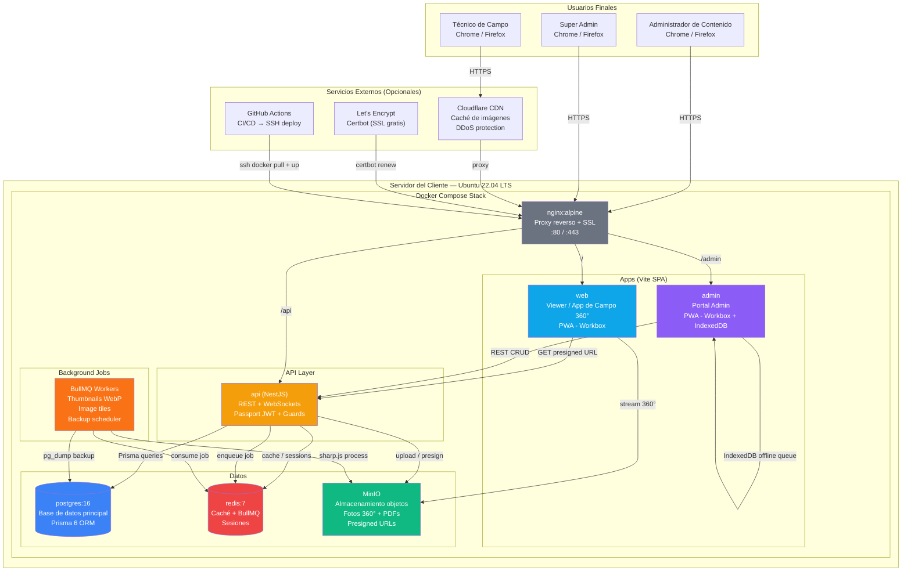
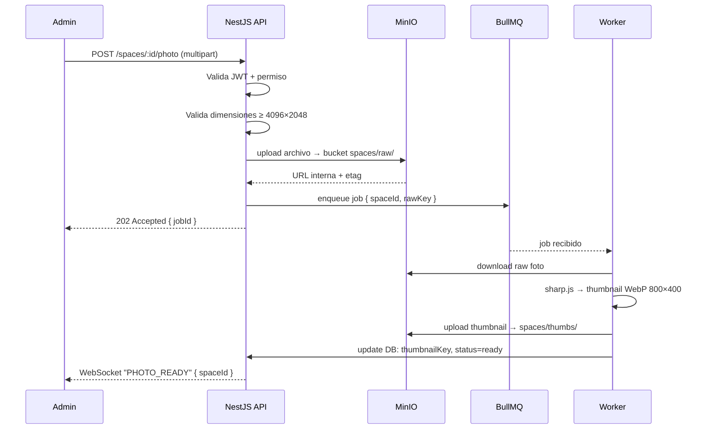
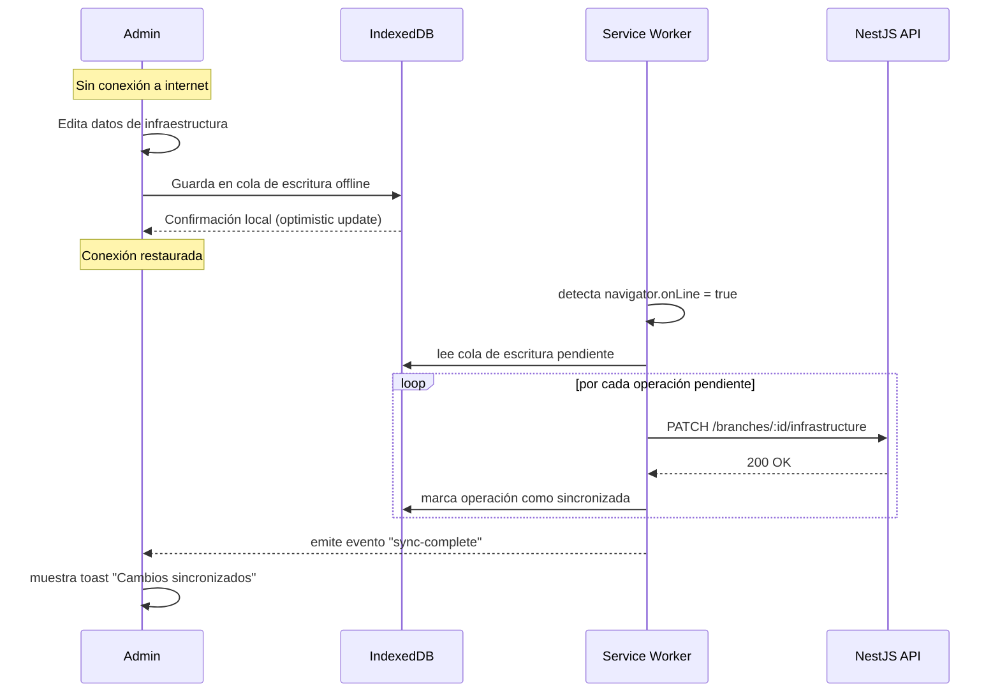
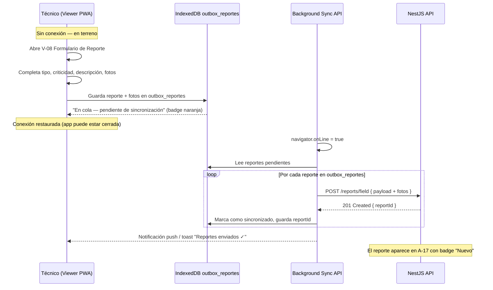

# Epic Architecture Specification — Virtual Tour Platform

> **Skill aplicada:** breakdown-epic-arch
> **Fecha:** 2026-05-29
> **Epic PRD base:** `docs/plan/virtual-tour-platform/epic.md`

---

## 1. Vista General de la Arquitectura

El sistema está compuesto por dos aplicaciones React independientes (viewer y admin) que se comunican con una API NestJS. Todo el stack se despliega en el servidor del cliente mediante Docker Compose. El almacenamiento de archivos es gestionado por MinIO (S3-compatible self-hosted). Los archivos 360° se sirven exclusivamente mediante presigned URLs con expiración. El admin funciona como PWA con soporte offline basado en IndexedDB.

---

## 2. Diagrama del Sistema



---

## 3. Arquitectura del Monorepo

```
virtual-tour-platform/
├── apps/
│   ├── web/              → Viewer / App de Campo (React 19 + Vite 6 + PSV — con autenticación)
│   ├── admin/            → Portal admin (React 19 + Vite 6 + shadcn/ui + React-Konva)
│   └── api/              → Backend (NestJS + Prisma 6 + BullMQ)
│
├── packages/
│   ├── ui/               → Design system compartido (shadcn/ui base)
│   ├── types/            → Tipos TypeScript compartidos (DTOs, enums)
│   ├── config/           → tsconfig, eslint, tailwind config base
│   └── api-client/       → Cliente REST tipado (generado desde OpenAPI)
│
├── docker/
│   ├── docker-compose.yml
│   ├── docker-compose.prod.yml
│   └── nginx/nginx.conf
│
├── scripts/
│   ├── install.sh         → Script de instalación automatizado
│   ├── migrate-photos.js  → Migración fotos existentes → MinIO
│   └── backup.sh          → Backup manual pg_dump
│
└── .github/
    └── workflows/
        ├── ci.yml          → Tests + build en PR
        └── deploy.yml      → Deploy SSH en push a main
```

---

## 4. Módulos NestJS (API)

```
api/src/
├── auth/              → JWT strategy, guards, refresh tokens
├── users/             → CRUD usuarios, roles, permisos
├── branches/          → CRUD sucursales (sucursales)
├── spaces/            → CRUD espacios 360°, reordenamiento
├── hotspots/          → CRUD hotspots, tipos flexibles
├── floor-plans/       → CRUD planimetrías, versionado, rollback
├── infrastructure/    → Comunicaciones, Baterías, Torres
├── documents/         → Biblioteca, versioning, full-text search
├── reports/           → Informes PDF manuales + Reportes de campo de técnicos (sync offline)
├── uploads/           → Orchestración de uploads → MinIO
├── jobs/              → BullMQ processors (thumbnails, backups)
├── config/            → Configuración de instancia (branding)
├── audit/             → Audit log de todas las acciones de escritura
├── notifications/     → Notificaciones internas
└── health/            → Health check endpoint (para Docker + monitoring)
```

---

## 5. Pantallas / Interfaces del Sistema

### 5.1 Viewer / App de Campo (apps/web) — 9 interfaces

| ID | Nombre | Descripción |
|----|--------|-------------|
| V-09 | Login | Formulario de autenticación JWT para acceder al viewer. Redirige a V-01 mostrando solo las sucursales del scope geográfico del usuario |
| V-01 | Lista de Sucursales | Grid/lista con portada, nombre, ciudad, estado. Filtros región/ciudad |
| V-02 | Visor 360° + Menú | Pantalla principal del tour. PSV fullscreen + menú contextual + mini-mapa overlay |
| V-03 | Panel — Comunicaciones | Panel deslizante con tabla de enlaces, proveedor, estado, documentos adjuntos |
| V-04 | Panel — Baterías | Panel con banco de baterías, capacidad, último mantenimiento |
| V-05 | Panel — Torre | Panel con datos técnicos de la torre por sucursal |
| V-06 | Panel — Informes / Biblioteca | Panel de descarga de PDFs categorizados |
| V-07 | Panel — Información | Panel con datos generales de la sucursal (dirección, contacto, área) |
| V-08 | Formulario Reporte en Campo | Formulario de inspección/falla offline con captura de fotos, criticidad y cola de sync |

### 5.2 Portal Admin (apps/admin) — 24 interfaces

| ID | Nombre | Descripción |
|----|--------|-------------|
| A-01 | Login | Formulario de autenticación JWT |
| A-02 | Dashboard | KPIs, sucursales activas, documentos recientes, alertas, actividad reciente |
| A-03 | Lista de Sucursales | Tabla con filtros, estado, acciones rápidas |
| A-04 | Crear / Editar Sucursal | Formulario completo de datos de la sucursal |
| A-05 | Galería de Espacios 360° | Grid de espacios de una sucursal, drag & drop para reordenar |
| A-06 | Upload de Foto 360° | Modal/panel con validación, progreso de upload y thumbnail preview |
| A-07 | Editor de Hotspots | Visor PSV en modo edición con doble clic para agregar hotspot |
| A-08 | Modal Configurar Hotspot | Selección de tipo + destino (espacio, doc, URL) |
| A-09 | Editor de Planimetría | Canvas React-Konva: subir plano, colocar marcadores, asignar a espacio |
| A-10 | Historial de Planimetrías | Lista de versiones con autor, fecha, comentario y botón rollback |
| A-11 | Gestión de Comunicaciones | Tabla CRUD de comunicaciones de la sucursal |
| A-12 | Gestión de Baterías | Tabla CRUD de bancos de baterías |
| A-13 | Gestión de Torres | Tabla CRUD de torres |
| A-14 | Biblioteca de Documentos | Lista/tabla con búsqueda full-text, filtro por categoría/tag |
| A-15 | Upload de Documento | Modal con categoría, tags, fecha, comentario de versión |
| A-16 | Historial de Versiones (Documento) | Lista de versiones con descarga individual y botón revertir |
| A-17 | Gestión de Inspecciones/Informes | Tabla de reportes de campo (de técnicos) + informes PDF manuales; filtros por fecha, tipo y estado; badges "Nuevo"; workflow de revisión |
| A-18 | Lista de Usuarios | Tabla CRUD de usuarios con roles y sucursales asignadas |
| A-19 | Crear / Editar Usuario | Formulario: nombre, email, rol, **sucursales asignadas (scope geográfico)** |
| A-20 | Audit Log | Tabla con filtros de fecha, usuario y acción |
| A-21 | Configuración de Instancia | Logo, nombre empresa, colores primarios, dominio, zona horaria |
| A-22 | Notificaciones | Centro de notificaciones internas del sistema |
| A-23 | Perfil de Usuario | Cambio de contraseña, preferencias de notificación |
| A-24 | Setup Wizard | Pantalla de primera instalación (branding + configuración inicial) |

**Total: 33 interfaces** (9 viewer + 24 admin)

---

## 6. Flujos de Datos Clave

### Flujo de Upload de Foto 360°


### Flujo de Sincronización Offline (Admin PWA)


### Flujo de Reporte de Campo (Técnico en Sitio — Offline)


---

## 7. Modelo de Datos (Resumen ER)

Las tablas principales del sistema PostgreSQL (gestionadas con Prisma 6):

```
INSTANCIA_CONFIG          → Configuración global de branding y licencia
USUARIOS                  → Autenticación + roles + permisos
ROLES / PERMISOS          → RBAC granular
USUARIOS_SUCURSALES       → Scope geográfico: qué sucursales puede ver/editar cada usuario
SUCURSALES                → Datos maestros de cada sucursal (latitud, longitud para mapa)
ESPACIOS_360              → Fotos 360° con thumbnails, orden
HOTSPOTS                  → Puntos de navegación/información sobre espacios
                            (tipo: pin | poligono | navegacion)
                            (columna vertices_yaw_pitch JSONB[] para polígonos)
PLANIMETRIAS              → Planos del canvas con datos JSON de marcadores
HISTORIAL_PLANIMETRIAS    → Versionado con rollback de planimetrías
COMUNICACIONES            → Infraestructura de red por sucursal
BATERIAS                  → Bancos de baterías por sucursal
TORRES                    → Torres por sucursal
CATEGORIAS_MENU           → Ítems del menú contextual del viewer
CATEGORIAS_DOCUMENTO      → Categorías de la biblioteca
DOCUMENTOS                → PDFs con metadata + link a MinIO
                            (adjuntable_id UUID, adjuntable_type VARCHAR: 'sucursal'|'espacio'|'hotspot')
VERSIONES_DOCUMENTO       → Historial de versiones de cada documento
REPORTES_CAMPO            → Reportes de inspección/falla registrados por técnicos desde el viewer
                            (campos: tipo, criticidad, descripcion, datos_falla JSONB,
                             status: nuevo|pendiente_revision|revisado,
                             fotos_keys JSONB[], tecnico_id, synced_at)
INFORMES                  → PDFs de informes manuales por sucursal con fecha y tipo
TAGS / DOCUMENTO_TAGS     → Etiquetas polimórficas
AUDIT_LOG                 → Registro inmutable de todas las acciones (login, logout, cambios con valor prev/next)
ACTIVIDAD_USUARIO         → Sesiones y accesos
NOTIFICACIONES            → Centro de notificaciones internas
```

**Estructura IndexedDB en cliente (apps/web + apps/admin):**
```
outbox_reportes           → Cola offline de reportes de campo pendientes de sync
                            (id, payload JSON, intentos, created_at_local)
offline_cache_infra       → Caché de datos de infraestructura por sucursal
offline_cache_docs        → Índice de documentos descargados para acceso offline
```

---

## 8. Stack Tecnológico

### Frontend
| Librería | Versión | Uso |
|----------|---------|-----|
| React | 19.x | Framework UI |
| TypeScript | 5.x | Tipado estático |
| Vite | 6.x | Build tool + HMR |
| React Router | v7 | Routing + code splitting |
| TanStack Query | v5 | Server state + cache |
| Zustand | 5.x | Client state global |
| React Hook Form + Zod | latest | Formularios + validación |
| shadcn/ui + Tailwind CSS | v4 | Design system |
| @photo-sphere-viewer/core | 5.x | Visor 360° + plugins |
| React-Konva | 9.x | Editor canvas planimetrías |
| vite-plugin-pwa + Workbox | latest | PWA offline |
| idb-keyval | 6.x | IndexedDB para cola offline |
| Lucide React | latest | Iconografía |

### Backend
| Librería | Versión | Uso |
|----------|---------|-----|
| NestJS | 11.x | Framework API |
| Prisma | 6.x | ORM + migraciones |
| PostgreSQL | 16 | Base de datos |
| MinIO Client SDK | 8.x | Almacenamiento objetos |
| BullMQ | 5.x | Cola de tareas background |
| Redis | 7.x | Cache + broker BullMQ |
| Sharp.js | 0.33.x | Procesamiento de imágenes |
| Passport.js + JWT | latest | Autenticación |
| Winston | 3.x | Logging estructurado |

### Infraestructura
| Servicio | Versión | Uso |
|----------|---------|-----|
| Docker + Docker Compose | 27+ | Contenedores |
| Nginx | alpine | Proxy reverso + SSL |
| Certbot | latest | SSL Let's Encrypt |
| GitHub Actions | — | CI/CD |
| Cloudflare | — | CDN + DDoS (opcional) |

---

## 9. Valor Técnico

**Alto** — El sistema introduce:
- Arquitectura modular con separación clara viewer/admin/api
- Modelo de despliegue reproducible (Docker Compose) que acorta el onboarding de nuevos clientes a < 30 minutos
- Capacidad offline real para el trabajo de campo mediante PWA + IndexedDB
- Base de datos con audit trail completo y versionado de archivos críticos

---

## 10. Estimación T-Shirt

| Componente | Estimación |
|------------|-----------|
| Viewer / App de Campo (8 interfaces) | M |
| Portal Admin — CRUD Básico (sucursales, docs, usuarios) | L |
| Editor de Planimetría (canvas) | L |
| Editor de Hotspots 360° | M |
| Offline PWA (IndexedDB queue + SW) | M |
| Setup Wizard + Configuración Instancia | S |
| CI/CD + Docker Compose + Scripts instalación | M |
| Migración fotos existentes | S |
| **Total Epic** | **XL** |

> Estimación de esfuerzo total: **4–6 meses** para un equipo de 2 desarrolladores full-stack + 1 QA parcial.