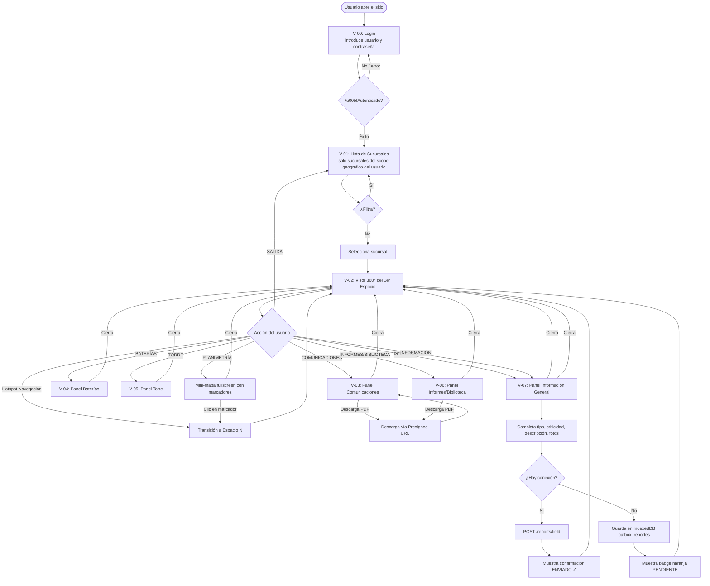
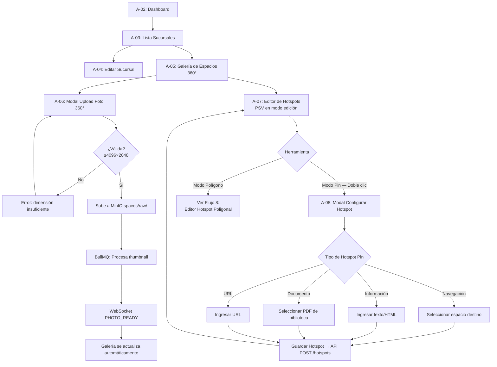
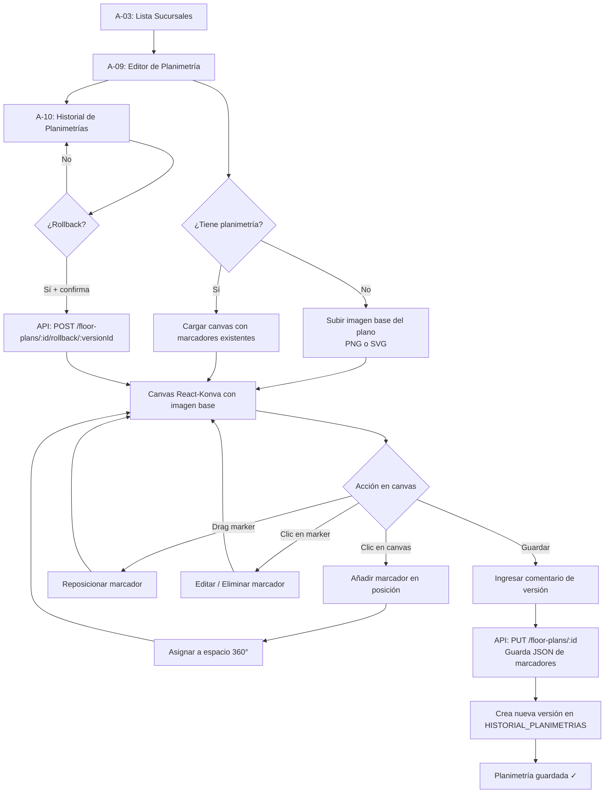
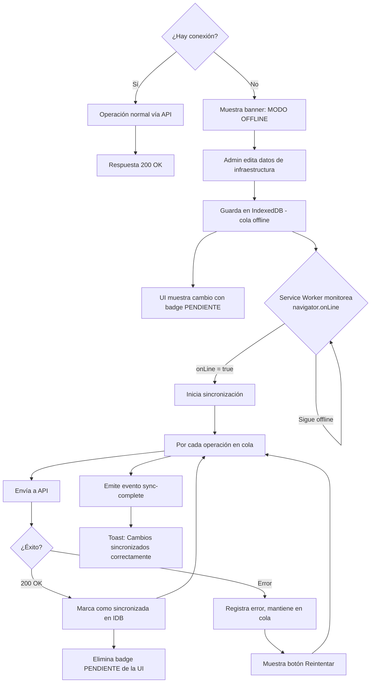
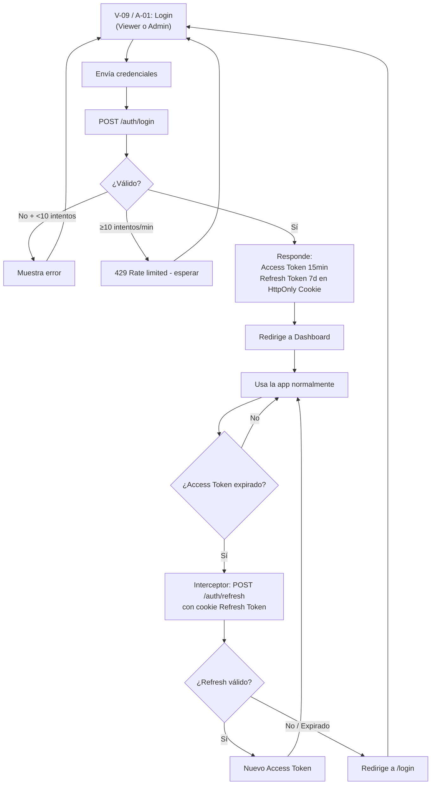

# Interfaces del Sistema y Diagramas de Flujo — Virtual Tour Platform

> **Fecha:** 2026-05-29

---

## 1. Inventario Completo de Interfaces

### Viewer / App de Campo (apps/web) — 9 pantallas

| ID | Nombre | Ruta | Descripción |
|----|--------|------|-------------|
| V-09 | Login | `/login` | Formulario de autenticación JWT. Redirige a V-01 mostrando solo las sucursales del scope geográfico del usuario |
| V-01 | Lista de Sucursales | `/` | Grid/lista de sucursales con portada, filtros de región/ciudad |
| V-02 | Visor 360° + Menú Contextual | `/sucursal/:id` | Pantalla principal del tour virtual, fullscreen |
| V-03 | Panel Comunicaciones | (overlay en V-02) | Panel deslizante lateral con datos de red |
| V-04 | Panel Baterías | (overlay en V-02) | Panel con datos de baterías |
| V-05 | Panel Torre | (overlay en V-02) | Panel con datos de la torre |
| V-06 | Panel Informes y Biblioteca | (overlay en V-02) | Lista de PDFs descargables |
| V-07 | Panel Información General | (overlay en V-02) | Datos de contacto, dirección, área de la sucursal |
| V-08 | Formulario Reporte en Campo | (overlay en V-02) | Formulario offline de inspección/falla: tipo, criticidad, descripción, fotos de cámara, estado de sync |

### Portal Admin (apps/admin) — 24 pantallas

| ID | Nombre | Ruta Admin | Descripción |
|----|--------|-----------|-------------|
| A-01 | Login | `/login` | Formulario de autenticación |
| A-02 | Dashboard | `/dashboard` | KPIs, alertas, actividad reciente |
| A-03 | Lista de Sucursales | `/sucursales` | Tabla con filtros, estado, acciones |
| A-04 | Crear / Editar Sucursal | `/sucursales/nueva`, `/sucursales/:id/editar` | Formulario completo |
| A-05 | Galería de Espacios 360° | `/sucursales/:id/espacios` | Grid con drag & drop |
| A-06 | Upload de Foto 360° | (modal sobre A-05) | Drag & drop + validación + progreso |
| A-07 | Editor de Hotspots | `/sucursales/:id/espacios/:spaceId/hotspots` | PSV en modo edición. Doble clic = hotspot pin. Modo polígono = trazar área de equipo por vértices Yaw/Pitch |
| A-08 | Modal Configurar Hotspot | (modal sobre A-07) | Tipo + destino dinámico. Para polígono: nombre del equipo + documentos adjuntos |
| A-09 | Editor de Planimetría | `/sucursales/:id/planimetria` | Canvas React-Konva |
| A-10 | Historial de Planimetrías | `/sucursales/:id/planimetria/historial` | Versiones + rollback |
| A-11 | Gestión de Comunicaciones | `/sucursales/:id/comunicaciones` | CRUD tabla |
| A-12 | Gestión de Baterías | `/sucursales/:id/baterias` | CRUD tabla |
| A-13 | Gestión de Torres | `/sucursales/:id/torres` | CRUD tabla |
| A-14 | Biblioteca de Documentos | `/sucursales/:id/documentos` | Búsqueda full-text + filtros |
| A-15 | Upload de Documento | (modal sobre A-14) | Form con categoría, tags, versión |
| A-16 | Historial de Versiones | (modal sobre A-14) | Versiones con descarga/rollback |
| A-17 | Gestión de Inspecciones/Informes | `/sucursales/:id/informes` | Tabla combinada: reportes de campo de técnicos + informes PDF manuales. Filtros: fecha, tipo (falla/inspección), estado (nuevo/pendiente/revisado). Badges "Nuevo". Workflow de revisión |
| A-18 | Lista de Usuarios | `/admin/usuarios` | CRUD tabla de usuarios |
| A-19 | Crear / Editar Usuario | `/admin/usuarios/nuevo`, `/admin/usuarios/:id` | Formulario |
| A-20 | Audit Log | `/admin/audit` | Tabla paginada con filtros |
| A-21 | Configuración de Instancia | `/admin/configuracion` | Branding, colores, timezone |
| A-22 | Centro de Notificaciones | `/admin/notificaciones` | Notificaciones del sistema |
| A-23 | Perfil de Usuario | `/admin/perfil` | Cambio de contraseña, preferencias |
| A-24 | Setup Wizard | `/setup` | Solo en primer arranque |

**Total: 33 interfaces** (9 Viewer + 24 Admin)

---

## 2. Flujo: Experiencia Completa del Viewer



---

## 3. Flujo: Administración de Espacios y Hotspots



---

## 4. Flujo: Editor de Planimetría



---

## 5. Flujo: Sincronización Offline (Admin PWA)



---

## 6. Flujo: Autenticación y Refresco de Token (Viewer y Admin)



---

## 7. Flujo: Instalación en Servidor Nuevo

```mermaid
flowchart TD
    SERVER[Servidor Ubuntu 22.04 LTS limpio] --> CMD[Técnico ejecuta:\ncurl -fsSL install.url | bash]
    CMD --> CHECK_DOCKER{¿Docker instalado?}
    CHECK_DOCKER -->|No| INSTALL_DOCKER[Script instala Docker + Compose]
    INSTALL_DOCKER --> CHECK_DNS
    CHECK_DOCKER -->|Sí| CHECK_DNS{¿Dominio apunta al servidor?}
    CHECK_DNS -->|No| WARN[Aviso: DNS no propagado\nSSL fallará. Continuar igual?]
    WARN --> WIZARD
    CHECK_DNS -->|Sí| WIZARD[Setup Wizard interactivo]

    WIZARD --> Q1[¿Nombre de la empresa?]
    Q1 --> Q2[¿Dominio? ej: tour.cliente.com]
    Q2 --> Q3[¿Email del admin inicial?]
    Q3 --> Q4[¿Password del admin inicial?]
    Q4 --> Q5[¿Timezone? UTC-3]
    Q5 --> Q6[¿Subir logo? s/n]

    Q6 --> GENERATE[Genera .env con secretos aleatorios]
    GENERATE --> COMPOSE[docker-compose up -d]
    COMPOSE --> WAIT[Espera a que todos los servicios estén healthy]
    WAIT --> SSL[Certbot: obtiene certificado Let's Encrypt]
    SSL --> MIGRATE_Q{¿Migrar fotos existentes?}
    MIGRATE_Q -->|Sí| MIGRATE[node migrate-photos.js --source=/path/fotos]
    MIGRATE --> DONE
    MIGRATE_Q -->|No| DONE[✅ Sistema listo]
    DONE --> URL[Abre https://dominio.com\nLogin con admin creado]
```

---

## 8. Flujo: Editor de Hotspot Poligonal (Área de Equipo)

```mermaid
flowchart TD
    A07[A-07: Editor de Hotspots] --> TOOL{Selecciona herramienta}
    TOOL -->|Modo Pin| DBLCLICK[Doble clic en imagen\nAgrega hotspot pin en Yaw/Pitch]
    TOOL -->|Modo Polígono| POLYGON_MODE[Activa modo polígono]

    POLYGON_MODE --> CLICK_VERTEX[Clic en imagen → agrega vértice N]
    CLICK_VERTEX --> MORE{¿Más vértices?}
    MORE -->|Sí| CLICK_VERTEX
    MORE -->|Clic sobre vértice 1| CLOSE_POLYGON[Cierra el polígono]

    CLOSE_POLYGON --> MIN_CHECK{¿≥ 3 vértices?}
    MIN_CHECK -->|No| ERROR[Error: polígono inválido]
    ERROR --> POLYGON_MODE
    MIN_CHECK -->|Sí| A08_POLY[A-08: Modal Configurar Área]

    A08_POLY --> FORM_POLY[Nombre del equipo\nTipo de equipo\nDocumentos adjuntos\nDescripción]
    FORM_POLY --> SAVE_POLY[POST /hotspots\n{ tipo: poligono,\n vertices: YawPitch[],\n equipo_id, docs[] }]
    SAVE_POLY --> RENDER[Viewer muestra overlay\nsemitransparente azul\nque ilumina al hover]

    DBLCLICK --> A08_PIN[A-08: Modal Configurar Pin]
    A08_PIN --> TIPO{Tipo de hotspot pin}
    TIPO -->|Navegación| SELECT_SPACE[Seleccionar espacio destino]
    TIPO -->|Información| TEXT_INPUT[Ingresar texto/HTML]
    TIPO -->|Documento| SELECT_DOC[Seleccionar PDF de biblioteca]
    TIPO -->|URL| URL_INPUT[Ingresar URL]
    SELECT_SPACE --> SAVE_HS[POST /hotspots]
    TEXT_INPUT --> SAVE_HS
    SELECT_DOC --> SAVE_HS
    URL_INPUT --> SAVE_HS
    SAVE_HS --> A07
    RENDER --> A07
```

---

## 9. Flujo: Registro y Sincronización de Reporte de Campo

```mermaid
flowchart TD
    V02[V-02: Visor 360°] -->|Menú REPORTAR| V08[V-08: Formulario Reporte]

    V08 --> FILL[Completa:\nTipo: Falla/Inspección\nCriticidad: Alta/Media/Baja\nDescripción libre\nFotos desde cámara dispositivo]

    FILL --> SUBMIT[Técnico envía el reporte]
    SUBMIT --> CONN{¿Hay conexión?}

    CONN -->|Sí| API_POST[POST /api/reports/field]
    API_POST --> API_OK[201 Created]
    API_OK --> BADGE_OK[Badge verde: Enviado ✓]
    BADGE_OK --> V02

    CONN -->|No| IDB_QUEUE[Guarda en IndexedDB\noutbox_reportes]
    IDB_QUEUE --> BADGE_PENDING[Badge naranja: Pendiente de sync]
    BADGE_PENDING --> V02

    IDB_QUEUE --> BSA{Background Sync API\n¿Conexión restaurada?\n(incluso con app cerrada)}
    BSA -->|Sí| SYNC_LOOP[Por cada reporte en outbox]
    SYNC_LOOP --> API_RETRY[POST /api/reports/field]
    API_RETRY --> RETRY_OK{¿Éxito?}
    RETRY_OK -->|Sí| CLEAR_QUEUE[Elimina de outbox\nActualiza a Enviado ✓]
    RETRY_OK -->|No| KEEP[Mantiene en cola\nregistra intento fallido]
    KEEP --> BSA

    API_OK --> ADMIN_A17[A-17: Portal Admin\nRecibe nuevo reporte]
    CLEAR_QUEUE --> ADMIN_A17
    ADMIN_A17 --> BADGE_NEW[Badge NUEVO en el reporte]
    BADGE_NEW --> REVIEW{Admin revisa}
    REVIEW -->|Abre reporte| READ_REPORT[Estado → pendiente_revisión]
    READ_REPORT --> ACTION_REVIEW[Admin agrega comentario\nCambia estado → revisado]
    ACTION_REVIEW --> AUDIT[Acción registrada en AUDIT_LOG]