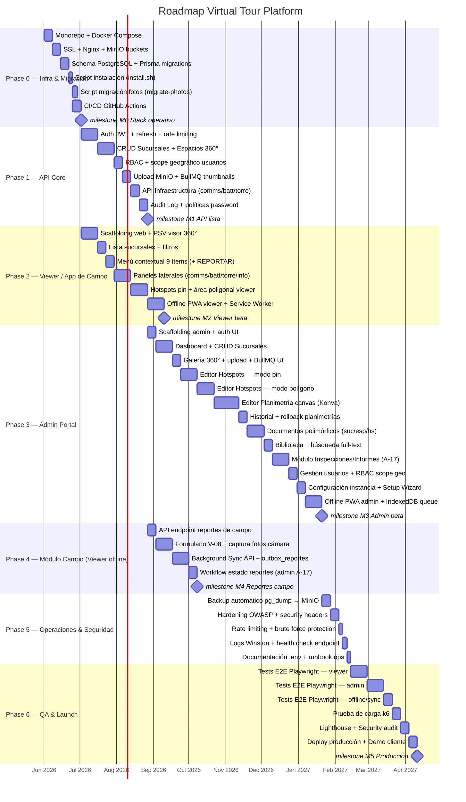
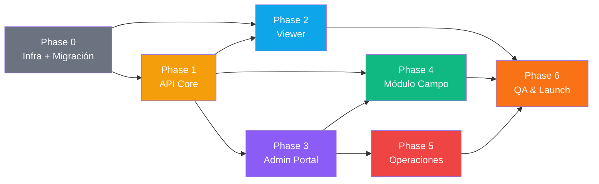

# Roadmap — Virtual Tour Platform

> **Fecha:** 2026-05-29 (actualizado con módulo de inspecciones, hotspots poligonales, RBAC geográfico)
> **Duración estimada:** 5–7 meses (equipo: 2 devs full-stack + 1 QA parcial)

---

## Carta Gantt — Vista por Fase

---

## Resumen por Fase

| Fase | Objetivo | Entregables Clave | Duración Est. | Equipo |
|------|----------|-------------------|---------------|--------|
| **Phase 0** | Infra base | Docker Compose, Nginx, SSL, MinIO, Prisma schema, CI/CD, scripts migración | 4 sem | Dev1 + Dev2 |
| **Phase 1** | API Core | Auth JWT + rate limiting, CRUD branches/spaces, RBAC geográfico, uploads, BullMQ, audit log, políticas password | 8 sem | Dev1 |
| **Phase 2** | Viewer / App de Campo | PSV 360°, V-09 Login + rutas protegidas, menú 9 ítems (+ REPORTAR), paneles, hotspots pin + polígono, offline PWA | 9 sem | Dev2 (paralelo con P1) |
| **Phase 3** | Portal Admin | Dashboard, galería, editor hotspots pin+polígono, planimetría canvas, documentos polimórficos, biblioteca, inspecciones, usuarios RBAC scope, offline PWA | 15 sem | Dev1 + Dev2 |
| **Phase 4** | Módulo Campo | API reportes, formulario V-08, Background Sync API, outbox_reportes, workflow estados | 6 sem | Dev2 (paralelo con P3 tardío) |
| **Phase 5** | Operaciones | Backup automático, hardening OWASP, rate limiting, logs, runbook | 3 sem | Dev1 |
| **Phase 6** | QA & Launch | E2E Playwright (viewer + admin + offline), k6 load test, Lighthouse, deploy prod | 8 sem | QA + Dev1 + Dev2 |

> **Phase 1 y Phase 2 corren en paralelo** desde semana 6 (Dev1 = API, Dev2 = Viewer).
> **Phase 4 y Phase 3 se solapan** las últimas 4 semanas de Phase 3.

---

## Tabla de Tareas Completa

### Phase 0 — Infraestructura & Migración

| ID | Tarea | Responsable | Est. | Deps | HU / RF |
|----|-------|-------------|------|------|---------|
| T-001 | Crear monorepo turborepo con apps/web, apps/admin, apps/api, packages/* | Dev1 | 2d | — | — |
| T-002 | Docker Compose: postgres, redis, minio, nginx + healthchecks | Dev1 | 2d | T-001 | — |
| T-003 | Nginx config: proxy reverso / → web, /admin → admin, /api → api, /minio → minio console | Dev1 | 1d | T-002 | — |
| T-004 | Certbot + renovación automática SSL Let's Encrypt | Dev1 | 1d | T-003 | RNF-05 |
| T-005 | MinIO: crear buckets spaces/raw, spaces/thumbs, documents, reports-fotos; policies read-only | Dev1 | 1d | T-002 | RF-07 |
| T-006 | Prisma schema v1: todas las tablas incluyendo REPORTES_CAMPO, USUARIOS_SUCURSALES, hotspots polimórficos | Dev2 | 3d | T-002 | RF-34..41 |
| T-007 | Seed inicial: admin user, roles, permisos, categorías menú | Dev2 | 1d | T-006 | RF-24 |
| T-008 | Script `install.sh`: instala Docker si ausente, wizard interactivo, genera .env con secretos, ejecuta compose | Dev1 | 2d | T-003 | RF-30 |
| T-009 | Script `migrate-photos.js`: --dry-run, valida dimensiones, sube a MinIO, asocia a sucursal en DB | Dev2 | 2d | T-006 | RF-31, HU-15 |
| T-010 | CI/CD GitHub Actions: ci.yml (lint+test en PR), deploy.yml (ssh docker pull+up en push a main) | Dev1 | 2d | T-001 | — |

### Phase 1 — API Core

| ID | Tarea | Responsable | Est. | Deps | HU / RF |
|----|-------|-------------|------|------|---------|
| T-011 | NestJS módulo Auth: registro, login, logout; JWT access 15min + refresh 7d en HttpOnly cookie | Dev1 | 3d | T-006 | RNF-06 |
| T-012 | Rate limiting login: máx 10 intentos/min por IP con @nestjs/throttler | Dev1 | 1d | T-011 | RNF-16, HU-12 |
| T-013 | Política de contraseñas: validación Zod min 8 chars + número + símbolo en registro/cambio | Dev1 | 1d | T-011 | RNF-16 |
| T-014 | RBAC: módulo users con roles (SuperAdmin/Admin/Editor/Viewer) + Prisma guards | Dev1 | 2d | T-011 | RF-25 |
| T-015 | Scope geográfico: tabla USUARIOS_SUCURSALES; endpoint asignar/revocar sucursales a usuario; guard que filtra queries por scope | Dev1 | 2d | T-014 | RF-41, HU-12 |
| T-016 | Audit Log: interceptor NestJS que registra user, action, entity_id, prev_value, new_value en AUDIT_LOG | Dev1 | 2d | T-014 | RF-26, RNF-17 |
| T-017 | CRUD Sucursales: endpoints + Prisma (create, read, list con filtros, update, soft-delete, toggle activo) | Dev1 | 2d | T-015 | RF-10 |
| T-018 | CRUD Espacios 360°: endpoints, validación dimensiones imagen, reordenamiento drag & drop (array de orden) | Dev1 | 2d | T-017 | RF-11, RF-13 |
| T-019 | Upload servicio: recibe multipart, valida, sube a MinIO, retorna key; soporta fotos 360° y documentos | Dev1 | 2d | T-005 | RF-11, RF-19 |
| T-020 | BullMQ processor: thumbnail WebP 800×400 con sharp.js al subir foto 360°; notifica via WS PHOTO_READY | Dev1 | 2d | T-019 | RF-12 |
| T-021 | CRUD Hotspots: endpoints; columna tipo enum (pin/poligono/navegacion); vertices_yaw_pitch JSONB[]; adjuntable polimórfico | Dev1 | 2d | T-018 | RF-15, RF-39 |
| T-022 | API Infraestructura: CRUD comunicaciones, baterías, torres por sucursal | Dev1 | 2d | T-017 | RF-18 |
| T-023 | API Planimetría: CRUD + versionado + rollback; guarda JSON marcadores con posicion_x/y y espacio_id | Dev1 | 2d | T-017 | RF-16, RF-17 |
| T-024 | API Documentos polimórficos: upload PDF; adjuntable_id + adjuntable_type (sucursal/espacio/hotspot); versioning | Dev1 | 2d | T-021 | RF-40, HU-10 |
| T-025 | Búsqueda full-text documentos: pg_trgm o tsvector en nombre + tags | Dev1 | 1d | T-024 | RF-21 |
| T-026 | API Reportes de Campo: POST /reports/field (recibe payload + fotos offline); GET con filtros fecha/tipo/estado; PATCH estado | Dev1 | 3d | T-017 | RF-34..38, HU-16 |
| T-027 | Presigned URLs: endpoint GET /files/presign?key= con expiración 15min; sin acceso público a MinIO | Dev1 | 1d | T-005 | RNF-07, RF-07 |
| T-028 | Health check endpoint: GET /health retorna estado de postgres, redis, minio | Dev1 | 1d | T-006 | — |

### Phase 2 — Viewer / App de Campo

| ID | Tarea | Responsable | Est. | Deps | HU / RF |
|----|-------|-------------|------|------|---------|
| T-029 | Scaffolding apps/web: Vite + React 19 + Tailwind + React Router v7 + TanStack Query; **V-09 Login** (React Hook Form + JWT + redirección por scope geográfico); PrivateRoute para rutas protegidas | Dev2 | 3d | T-001, T-011 | RF-24, RF-41 |
| T-030 | Integrar @photo-sphere-viewer/core v5 + plugins (markers, virtual-tour) | Dev2 | 2d | T-029 | RF-03 |
| T-031 | V-01 Lista de Sucursales: grid con portada thumbnail, nombre, ciudad, estado; filtros región/ciudad | Dev2 | 2d | T-030 | HU-01, RF-01, RF-02 |
| T-032 | V-02 Visor 360° fullscreen: carga primer espacio, navegación mouse/touch | Dev2 | 2d | T-031 | HU-01, RF-03 |
| T-033 | Menú contextual 9 ítems: COMUNICACIONES, BATERÍAS, TORRE, INFORMES, PLANIMETRÍA, BIBLIOTECA, REPORTAR, INFORMACIÓN, SALIDA | Dev2 | 2d | T-032 | RF-05 |
| T-034 | Paneles laterales: V-03 Comunicaciones, V-04 Baterías, V-05 Torre, V-07 Información | Dev2 | 3d | T-033 | HU-02, HU-03 |
| T-035 | Panel V-06 Informes/Biblioteca: lista PDFs con categoría + descarga vía presigned URL | Dev2 | 2d | T-034 | HU-04, RF-07 |
| T-036 | Hotspots pin en viewer: navegar entre espacios 360° al hacer clic en hotspot de navegación | Dev2 | 2d | T-032 | HU-01, RF-08 |
| T-037 | Hotspots área poligonal en viewer: renderizar overlay semitransparente azul; panel contextual al clic con datos del equipo + documentos adjuntos | Dev2 | 3d | T-036 | RF-39, RF-40 |
| T-038 | Mini-mapa planimetría: overlay en esquina inferior del visor; clic en marcador navega al espacio | Dev2 | 2d | T-032 | HU-05, RF-04 |
| T-039 | V-08 Formulario Reporte en Campo: campos tipo/criticidad/descripción/fotos; submit a API o IndexedDB | Dev2 | 3d | T-033 | HU-16, RF-34, RF-35 |
| T-040 | Offline PWA viewer: vite-plugin-pwa + Workbox; precache assets; TanStack Query persistencia IndexedDB para datos de sucursales visitadas | Dev2 | 3d | T-031 | HU-06, RF-09, RNF-10 |
| T-041 | Background Sync API viewer: outbox_reportes en IndexedDB; registro Service Worker sync tag; retry automático al recuperar conexión (app cerrada OK) | Dev2 | 3d | T-039 | RF-36, RNF-15 |
| T-042 | Banner offline viewer: detectar navigator.onLine; modo offline UI (banner azul top) | Dev2 | 1d | T-040 | HU-06 |

### Phase 3 — Portal Admin

| ID | Tarea | Responsable | Est. | Deps | HU / RF |
|----|-------|-------------|------|------|---------|
| T-043 | Scaffolding apps/admin: Vite + React 19 + Tailwind + shadcn/ui + React Router v7 + TanStack Query | Dev1 | 2d | T-001 | — |
| T-044 | A-01 Login: formulario con React Hook Form + Zod; JWT auth; indicador rate limit; redirección por rol | Dev1 | 2d | T-043 | HU-12, RF-24 |
| T-045 | A-02 Dashboard: KPIs (sucursales activas, docs recientes, reportes nuevos), actividad reciente desde audit log | Dev1 | 2d | T-044 | RF-27 |
| T-046 | A-03/04 Lista + CRUD Sucursales: tabla paginada, filtros, crear/editar formulario completo, toggle activo | Dev1 | 2d | T-045 | RF-10, HU-09 |
| T-047 | A-05/06 Galería Espacios 360° + upload: drag & drop reordenar; modal upload con validación + barra progreso; WS PHOTO_READY | Dev1 | 3d | T-046 | HU-07, RF-11..13 |
| T-048 | A-07/08 Editor Hotspots — modo pin: PSV edición, doble clic agrega pin, modal tipo/destino | Dev2 | 3d | T-047 | HU-08, RF-14, RF-15 |
| T-049 | A-07 Editor Hotspots — modo polígono: activar modo, clic agrega vértice Yaw/Pitch, cerrar polígono, modal nombre equipo + docs adjuntos | Dev2 | 4d | T-048 | RF-39 |
| T-050 | A-09/10 Editor Planimetría canvas (React-Konva): subir imagen base, colocar/arrastrar marcadores, asignar a espacio; guardar JSON; rollback versiones | Dev2 | 5d | T-046 | HU-09, RF-16, RF-17 |
| T-051 | A-11/12/13 CRUD Infraestructura: tablas CRUD inline para comunicaciones, baterías, torres | Dev1 | 3d | T-046 | RF-18, HU-03 |
| T-052 | A-14/15/16 Biblioteca Documentos polimórfica: upload PDF a nivel sucursal/espacio/hotspot; categoría, tags, versioning, búsqueda full-text | Dev1 | 4d | T-047 | RF-19..22, RF-40, HU-10 |
| T-053 | A-17 Módulo Inspecciones/Informes: tabla unificada reportes campo + informes manuales; filtros fecha/tipo/estado; badge "Nuevo"; workflow revisión | Dev1 | 4d | T-052 | RF-37, RF-38, HU-16 |
| T-054 | A-18/19 Gestión Usuarios: CRUD; asignación rol; asignación scope geográfico (sucursales); desactivar usuario | Dev1 | 3d | T-044 | RF-24, RF-25, RF-41, HU-12 |
| T-055 | A-20 Audit Log: tabla paginada; filtros fecha/usuario/acción; columnas prev_value/new_value expandibles | Dev1 | 2d | T-054 | RF-26, RNF-17 |
| T-056 | A-21/24 Configuración instancia + Setup Wizard: logo, nombre empresa, colores, timezone; bloqueado tras primer uso | Dev1 | 2d | T-044 | HU-13, RF-28 |
| T-057 | A-23 Perfil de usuario: cambio password con validación política (8 chars, num, símbolo) | Dev1 | 1d | T-044 | RNF-16 |
| T-058 | Offline PWA admin: vite-plugin-pwa + Workbox; IndexedDB cola offline para ediciones infraestructura; banner offline | Dev2 | 4d | T-051 | HU-11, RF-09, RNF-09 |
| T-059 | Sync admin offline: Service Worker monitorea onLine; envía cola a API al reconectar; toast "Cambios sincronizados" | Dev2 | 2d | T-058 | HU-11 |

### Phase 4 — Módulo Campo (paralelo con Phase 3 tardío)

| ID | Tarea | Responsable | Est. | Deps | HU / RF |
|----|-------|-------------|------|------|---------|
| T-060 | API endpoint POST /reports/field: valida payload, sube fotos a MinIO (bucket reports-fotos), crea REPORTE_CAMPO | Dev1 | 2d | T-026 | RF-34, RF-35 |
| T-061 | Formulario V-08 completo: React Hook Form + Zod; input type=file capture=environment para fotos cámara; preview miniaturas | Dev2 | 3d | T-039 | RF-35, HU-16 |
| T-062 | outbox_reportes IndexedDB schema: Dexie.js; guardar reporte + blobs fotos; reintentos con backoff | Dev2 | 2d | T-061 | RF-36 |
| T-063 | Background Sync API: registrar sync tag 'reportes-campo'; evento sync del SW procesa outbox completo; fallback polling si BS no soportado | Dev2 | 3d | T-062 | RNF-15, RF-36 |
| T-064 | Badge estado reporte en viewer: Pendiente (naranja) / Enviado (verde) / Error (rojo) con contador en menú | Dev2 | 1d | T-063 | HU-16 |
| T-065 | Workflow estados admin A-17: botones Marcar como revisado / Pendiente revisión; PATCH /reports/:id/status; audit log | Dev1 | 2d | T-053 | RF-37, HU-16 |

### Phase 5 — Operaciones & Seguridad

| ID | Tarea | Responsable | Est. | Deps | HU / RF |
|----|-------|-------------|------|------|---------|
| T-066 | Backup automático: cron BullMQ semanal; pg_dump gzip → MinIO bucket backups; retención 30 días | Dev1 | 2d | T-020 | RF-32 |
| T-067 | Security headers Nginx: HSTS, X-Frame-Options, CSP, X-Content-Type-Options | Dev1 | 1d | T-003 | RNF-05 |
| T-068 | OWASP hardening: validar todos los inputs con Zod; Prisma parameterized queries revisión; dependabot | Dev1 | 2d | T-028 | RNF-08 |
| T-069 | Logs estructurados Winston: request log, error log, rotación 30 días; nivel configurable por .env | Dev1 | 1d | T-028 | RNF-11 |
| T-070 | Documentación .env.example comentado + runbook de operaciones (backup, restaurar, actualizar imagen) | Dev1 | 2d | T-066 | RF-30 |

### Phase 6 — QA & Lanzamiento

| ID | Tarea | Responsable | Est. | Deps | HU / RF |
|----|-------|-------------|------|------|---------|
| T-071 | Playwright E2E viewer: flujo completo tour, paneles, descarga PDF, hotspot navegación + polígono | QA | 4d | T-042 | HU-01..06 |
| T-072 | Playwright E2E viewer offline: desconectar red, registrar reporte, reconectar, verificar sync | QA | 2d | T-064 | HU-06, HU-16 |
| T-073 | Playwright E2E admin: login, CRUD sucursal, upload 360°, editor hotspots pin + polígono, planimetría | QA | 5d | T-059 | HU-07..11 |
| T-074 | Playwright E2E admin offline: editar infra sin red, verificar IDB, reconectar, verificar sync | QA | 2d | T-059 | HU-11 |
| T-075 | Playwright E2E inspecciones: crear reporte campo, workflow revisión admin, filtros A-17 | QA | 2d | T-065 | HU-16 |
| T-076 | Playwright E2E usuarios + RBAC: crear usuario con scope geográfico, verificar restricciones | QA | 2d | T-054 | HU-12, RF-41 |
| T-077 | k6 load test: 50 usuarios concurrentes en viewer; verificar p95 ≤ 3s | QA | 3d | T-071 | RNF-01, RNF-02 |
| T-078 | Lighthouse audit: Performance ≥ 90, Accessibility ≥ 85, PWA checklist completo | QA | 2d | T-072 | RNF-14 |
| T-079 | Security audit: ZAP scan, revisar headers, CSP, cookies HttpOnly/Secure | Dev1 | 2d | T-067 | RNF-05..08 |
| T-080 | Deploy producción: docker pull + up en servidor cliente; seed datos reales; DNS + SSL verificado | Dev1 | 2d | T-070 | HU-14 |
| T-081 | Demo cliente + capacitación admin: walkthrough funcionalidades, entrega documentación usuario | Dev1+Dev2 | 2d | T-080 | — |

---

## Milestones

| Milestone | Descripción | Criterio de Completado |
|-----------|-------------|------------------------|
| **M0 — Stack operativo** | Infraestructura Docker up en staging | `GET /health` → 200; viewer y admin cargan en HTTPS; MinIO accesible |
| **M1 — API lista** | Todos los endpoints documentados y testeados | Colección Postman completa; auth + CRUD funcional; scope geográfico activo |
| **M2 — Viewer beta** | Tour 360° completo con reportes de campo | 9 ítems del menú funcionan; hotspots pin + polígono; sync offline viewer OK |
| **M3 — Admin beta** | Portal admin funcional end-to-end | Admin publica sucursal completa; módulo inspecciones activo; RBAC geo activo |
| **M4 — Reportes campo** | Ciclo completo de inspección offline | Técnico registra reporte offline → sync Background Sync → visible en A-17 |
| **M5 — Producción** | Sistema en servidor del cliente con datos reales | Demo aprobada; Lighthouse ≥ 90; 0 bugs críticos; Playwright E2E ≥ 80% |

---

## Dependencias entre Fases

---

## Conteo de Tareas por Fase

| Fase | Tareas | Esfuerzo Total Est. | Responsable Principal |
|------|--------|--------------------|-----------------------|
| Phase 0 — Infra | T-001 → T-010 | 10 tareas / ~17d | Dev1 + Dev2 |
| Phase 1 — API Core | T-011 → T-028 | 18 tareas / ~34d | Dev1 |
| Phase 2 — Viewer | T-029 → T-042 | 14 tareas / ~31d | Dev2 |
| Phase 3 — Admin | T-043 → T-059 | 17 tareas / ~47d | Dev1 + Dev2 |
| Phase 4 — Campo | T-060 → T-065 | 6 tareas / ~13d | Dev1 + Dev2 |
| Phase 5 — Ops | T-066 → T-070 | 5 tareas / ~8d | Dev1 |
| Phase 6 — QA | T-071 → T-081 | 11 tareas / ~26d | QA + Dev1 |
| **TOTAL** | **T-001 → T-081** | **81 tareas** | — |

---

## Riesgos del Roadmap

| Riesgo | Probabilidad | Impacto | Mitigación |
|--------|-------------|---------|-----------|
| Editor planimetría canvas más complejo de lo estimado | Media | +2 sem Phase 3 | Spike técnico 2d antes de T-050; evaluar librería alternativa (fabric.js) |
| Hotspot poligonal en PSV requiere librería custom o fork | Alta | +1 sem Phase 2 | Investigar PSV v5 markers API vs overlay canvas personalizado; fallback: overlay SVG |
| Background Sync API no soportado en todos los navegadores objetivo | Baja | Fallback offline | Implementar polling fallback con navigator.onLine como contingencia en T-063 |
| Performance visor 360° en red lenta | Media | Retraso M2 | Tiles progresivos PSV desde T-030; CDN Cloudflare opcional |
| Fotos legadas con resolución insuficiente | Media | Bloqueo migración | --dry-run en T-009 antes de migrar; negociar re-captura con cliente |
| SSL falla por DNS no propagado | Baja | Bloqueo M0 | Validar DNS en install.sh antes de ejecutar Certbot |